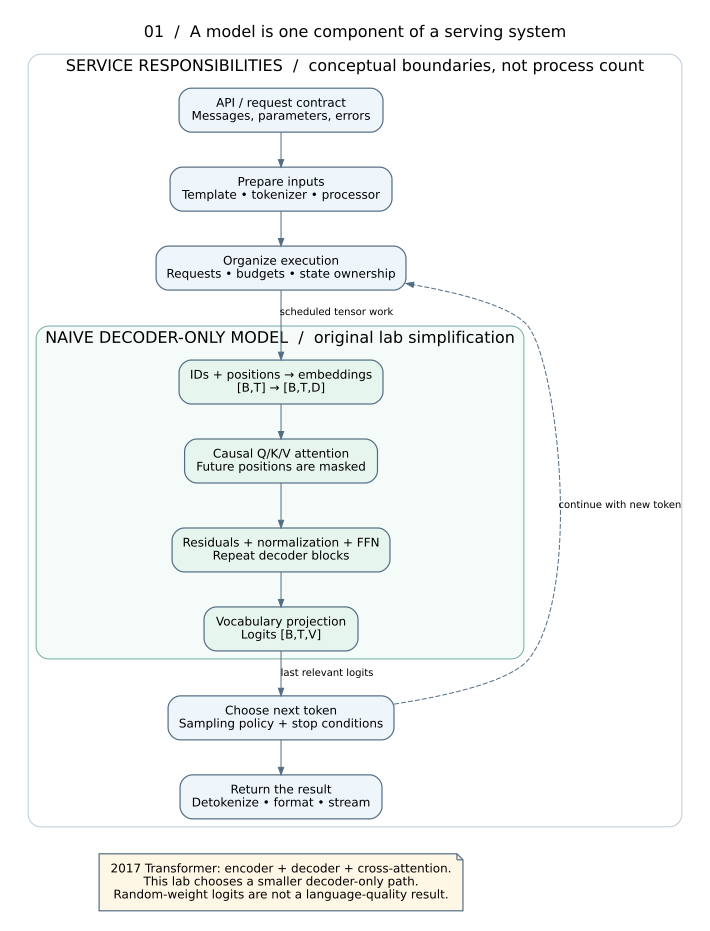
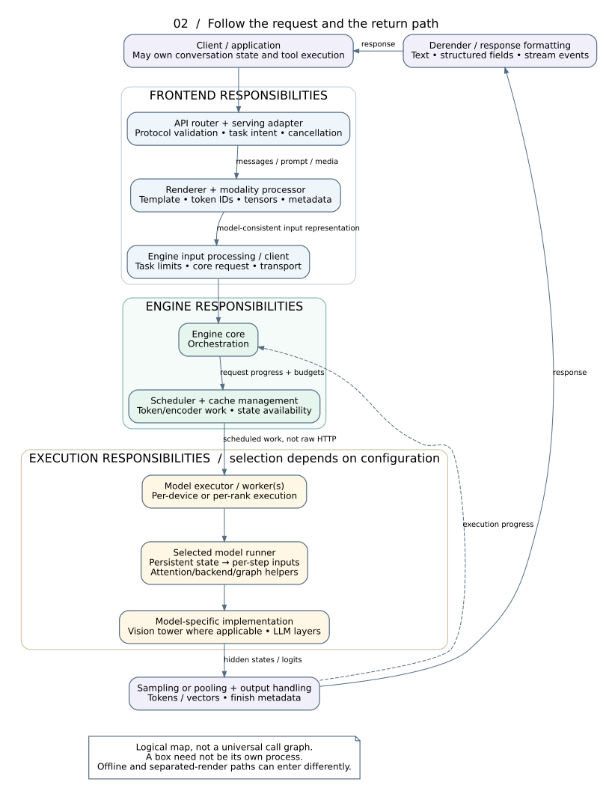
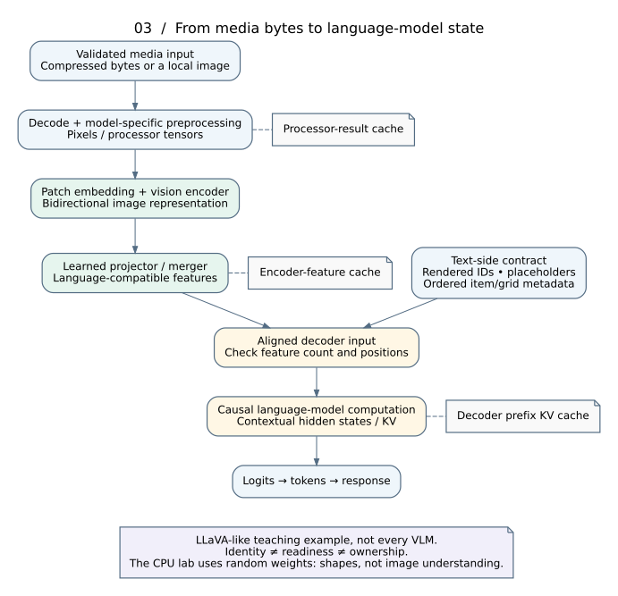
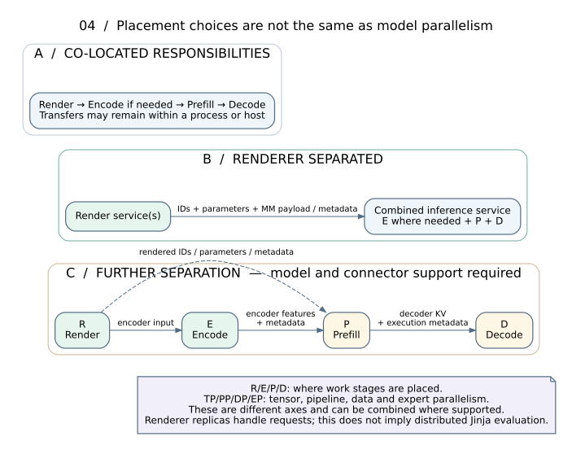

# Architecture atlas: computation, contracts and placement

Read the overview first, then revisit the detailed figures after lessons 09 and 13. The figures are original conceptual diagrams, not traces captured from a production deployment. A box is a **responsibility**, not necessarily a separate process or host.

## 1. Start with the smallest truthful map

A naive text decoder consumes token IDs and positions, computes contextual representations, produces vocabulary logits, and lets a decoding policy select the next token. It does not inherently parse HTTP, download images, expand a conversation history, choose a GPU replica or decide when a cancelled request's storage is reusable. Those are additional service responsibilities. The original Transformer is encoder-decoder; the chosen lab is a simpler decoder-only teaching variant. [R03, R25](REFERENCES.md)

## 2. Production responsibilities and contracts

| Responsibility | Input → output | What the learner must distinguish | Source target |
|---|---|---|---|
| Transport/API router | HTTP request → validated handler call / response stream | Transport framing, errors, cancellation and model task support are not neural computation. | `api` |
| Serving adapter | Protocol-specific fields → task intent, effective parameters and conversation | Chat, completion and Responses differ at the protocol boundary; persistent state may need resolution before rendering. | API handler reached from `api` |
| Renderer | Messages/text/media → model-consistent token IDs, processor data and metadata | Template rendering is not text generation or image rendering; tokenizer work is not GPU attention. | `renderer`, `render-wire` |
| Multimodal input processor | Ordered modality items and prompt → processed tensors, hashes, placeholder updates | A decoded image and its neural features are different objects. | `processor` |
| Engine input processor | Rendered/raw inputs and task parameters → validated core request | Model task/config limits are checked before expensive execution; paths may invoke preprocessing as needed. | `input` |
| Engine client / IPC | Requests, aborts and outputs across boundaries | A local function call, thread handoff and process/network transfer have different costs and lifetime rules. | Architecture docs [R25] |
| Engine core | Pending requests and execution results → iterative orchestration | Coordinates scheduling and execution; not the decoder neural layer itself. | `core` |
| Scheduler | Request progress + budgets + state availability → scheduled work | Admission, token work and encoder work are resources, not just a list of prompt strings. | `scheduler` |
| KV and encoder cache managers | Needed state → allocated/reusable state descriptors | Identity, ownership, readiness and eviction policy differ from attention mathematics. | Existing Academy KV map; [R28–R29] |
| Model executor / workers | Execution plan → local/per-rank execution | In this context an executor is not the renderer's CPU thread pool. Worker placement depends on the configuration. | [R25], `runner` |
| Model runner | Scheduled inputs + persistent request state → model inputs, backend calls and outputs | Per-step packed data is distinct from persistent request state; runner is distinct from model implementation. | `runner`, [R30] |
| Model / vision tower / layers | Tensors → hidden states/features/logits | Model-specific architecture belongs here, not indiscriminately in the common runner. | `vlm`, `runner` |
| Sampling / pooling | Logits or hidden states → token choices or embeddings/scores | Not every API ends in autoregressive token sampling. | [R26], `input` |
| Output processing / derendering | Tokens and finish metadata → text, protocol fields, stream events | Detokenization, reasoning/tool parsing, finish reasons and usage form a separate return path. | `render-wire`, `api` |

Source IDs refer to [the pinned source map](SOURCE_MAP.md). This table is a responsibility map synthesized from selected code and documentation, not a proven call graph for every endpoint. In particular, frontend rendering and raw-input preprocessing can enter via different paths. [R25–R30](REFERENCES.md)

## 3. API families: do not confuse protocol, task and model

| Interface family | Typical data | Teaching emphasis |
|---|---|---|
| Offline Python generation | Local prompts or tokenized inputs | No HTTP is required to use an engine. |
| Completions: `/v1/completions` | Prompt text or supported token input | Continue a sequence; do not silently impose a chat template. |
| Chat: `/v1/chat/completions` | Role-based messages and supported content items | Model-compatible template and content processing are essential. |
| Responses: `/v1/responses` | Structured input/output items, instructions and optional state references | Protocol state and history handling are distinct from a decoder KV cache. |
| Embeddings: `/v1/embeddings` | Input → embedding vectors | Requires a compatible task/model; not “sample a token and rename it an embedding.” |
| Audio transcription/translation | Audio → recognized/translated text | Requires an applicable speech model and audio preprocessing, not arbitrary text-only weights. |
| Render / derender and token service | Serialized request ↔ model inputs/output items | Internal service boundaries have compatibility and transport contracts. |

The current API docs describe model/task restrictions; one server or checkpoint does not support every family merely because the framework documents it. Inspect that server's OpenAPI and selected task as part of the lab. Batch variants, scoring/reranking, operations endpoints and detailed tool semantics are extension readings, not all mandatory implementations. [R26](REFERENCES.md)

**Streaming is another axis.** Completion/chat-like interfaces may return accumulated JSON or incremental events. An output token, a decoded character, a JSON delta, an SSE event and a network read are not identical units. Tool-call parsing is not tool execution. Returning reasoning-related fields is not proof about any hidden internal reasoning process.

## 4. Multimodal input is more than a string containing `<image>`

For the LLaVA-like teaching example, distinguish: compressed image bytes; decoded pixels; resized/normalized processor tensors; patch vectors; vision features; projected language-width embeddings; a decoder input sequence aligned with those embeddings; and decoder KV state. A model may instead use crops, variable grids, token mergers or cross-attention. The figure deliberately does not claim one universal VLM architecture. [R19–R21, R28](REFERENCES.md)

The pinned LLaVA implementation has an image-input parser, a vision tower, a multimodal projector and a language model. It can also accept precomputed image embeddings on applicable paths. Its input token positions already account for inserted image features. These observations motivate the shape ledger; they do not validate this supplement as a LLaVA runner. [Pinned source](https://github.com/vllm-project/vllm/blob/b558f160a2c0abcb5902acc3c91a14c38a4af173/vllm/model_executor/models/llava.py#L450-L670)

A useful synthetic ledger is `1×3×8×8` image → four flattened 4×4 RGB patches → `1×4×12` vision features → `1×4×24` projected features → replacement at four placeholder positions in a `1×9×24` decoder input. These numbers are original lab dimensions, **not** Llama, Qwen or LLaVA specifications.

## 5. Four different caches

| Cached object | Representative identity dependencies | Why reuse can fail |
|---|---|---|
| Media/processor result | Media content + processor/options revision | Same URL or shape does not guarantee same bytes or transformations. |
| Vision/encoder features | Processed input + encoder/projector weights and options | A new encoder or feature-selection policy changes the result. |
| Decoder prefix KV | Model/cache representation + exact effective context and modality identity | The same image under a different preceding text context is not generally identical decoder state. |
| Application response/history | Conversation/user/session semantics | This is not the same cache as any neural intermediate state. |

These are course-designed reasoning categories, not a claim that every vLLM deployment implements all four caches as separate services. The inspected processing and disaggregated-encoder docs explicitly separate processor output and encoder state from decoder inference. [R28–R29](REFERENCES.md)

**Identity answers “what result is this?” Readiness answers “may it be read?” Ownership answers “may its storage be overwritten?”** Never substitute one for another. A lookup hit is not transfer completion.

## 6. What “distributed chat-template rendering” should mean here

Teach disaggregated **request rendering**, not the unsupported idea that one Jinja template must be split across TP ranks. A renderer replica can process complete requests while other replicas process other requests. Its output goes to an inference service; postprocessing can be separated too. Co-located and disaggregated versions should implement equivalent input contracts.

At the inspected pin, render routes construct token-in generation requests. For multimodal inputs they can contain hashes, placeholder ranges and serialized processor tensors as well as metadata. Sending only IDs can therefore lose information. The documented Responses renderer is stateless: callers resolve stored history before rendering. The standard server requires an explicit scale-out opt-in for relevant internal routes. [R27; pinned renderer document](https://github.com/vllm-project/vllm/blob/b558f160a2c0abcb5902acc3c91a14c38a4af173/docs/serving/online_serving/renderer.md)

Use the contracts below before discussing machines:

| Boundary | Main object crossing it | Failure to prevent |
|---|---|---|
| R → combined inference | Token IDs, options, ordered multimodal processor payload/metadata | Template/tokenizer/processor mismatch, missing media data, oversized payload. |
| E → P | Vision/encoder embeddings plus matching item/grid metadata | Reading an unpublished or wrong-order embedding; losing model-specific positioning metadata. |
| P → D | Decoder KV state and execution/transfer metadata | Wrong cache layout, partial transfer, early source/destination reuse. |
| D → output service | Generated token IDs and finish/usage information | Misframed stream, lost cancellation or duplicate terminal output. |

Not all arrows are network transfers in a co-located deployment. Encoder and P/D disaggregation are separate choices. TP partitions tensor operations, PP partitions model stages, DP replicates execution, and EP partitions experts; these axes are not synonyms for R/E/P/D placement. The course covers their purpose and data movement before assigning distributed implementation work. [R25, R29](REFERENCES.md)

## 7. Common questions to ask at every boundary

What exact object is passed? Which component validates it? Which configuration identifies its semantics? Who owns the memory? When is it ready? What cancels the work? What happens on failure? Which measurement captures its cost? Answering these questions is more transferable than memorizing a current class name.
